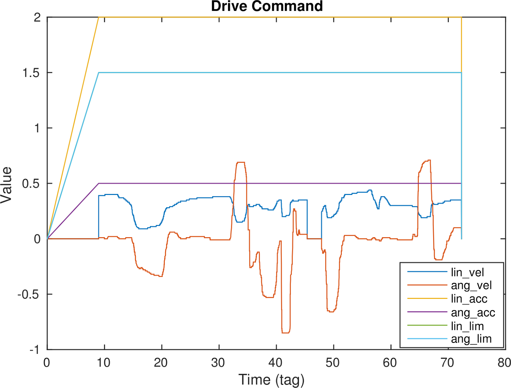
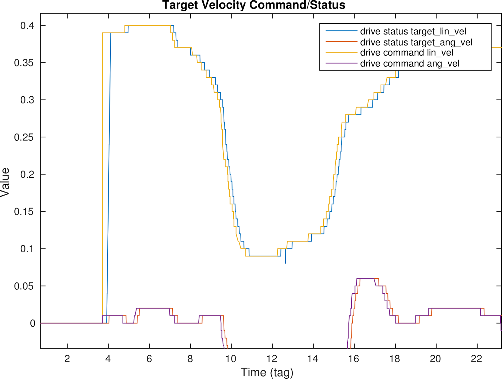
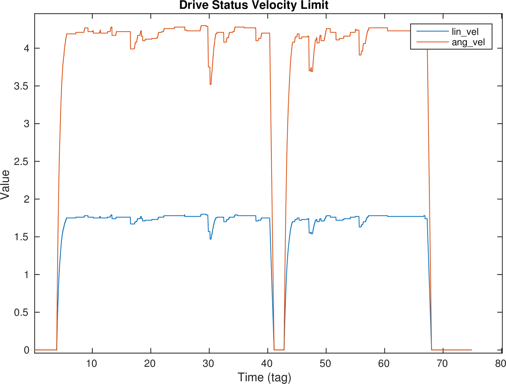
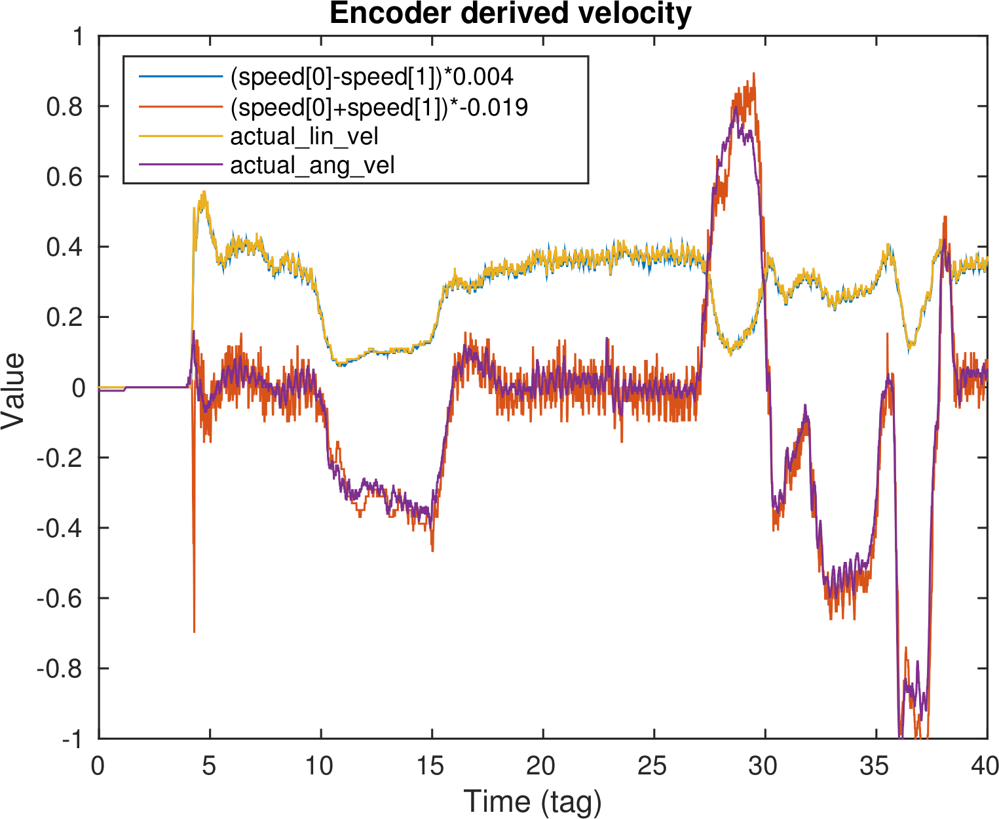
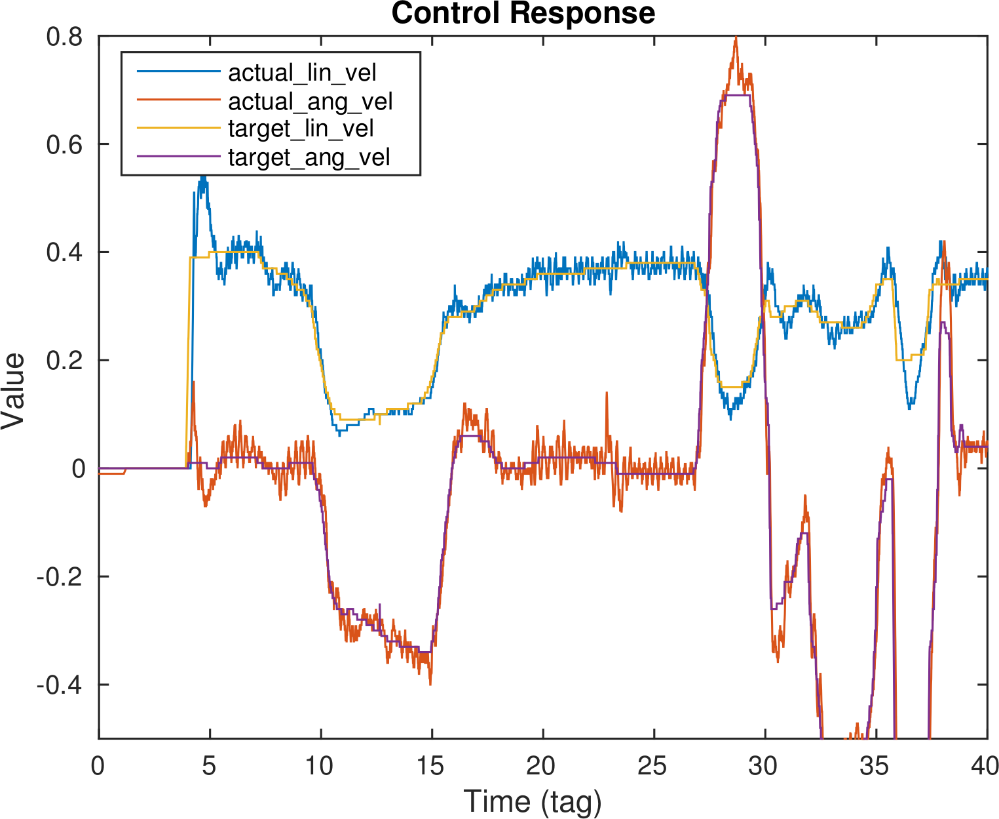
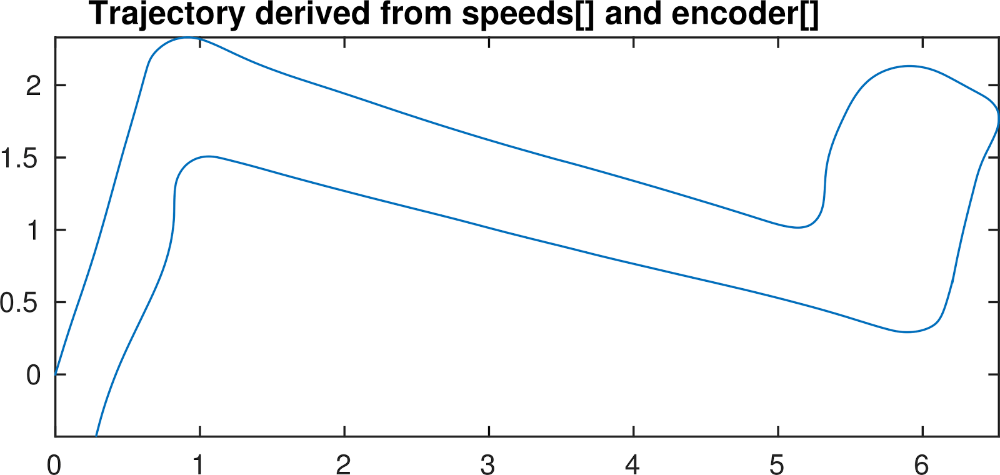
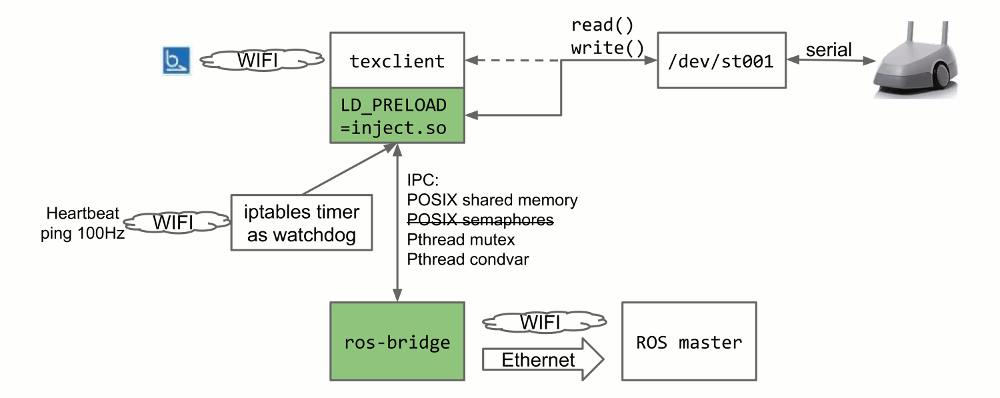

# Beam Internals

## Filesystem Structures

The SD card in Beam stores everything that Beams run on. Its partition layout is this:

```
$ sudo parted /dev/mmcblk0 print
Model: SD SP04G (sd/mmc)
Disk /dev/mmcblk0: 3964MB
Sector size (logical/physical): 512B/512B
Partition Table: msdos

Number  Start   End     Size    Type     File system  Flags
 1      32.3kB  987MB   987MB   primary  ext4         boot
 2      987MB   2969MB  1982MB  primary  ext4
 3      2969MB  3956MB  987MB   primary  ext4
```

After default mounting on Ubuntu 14.04 trusty, the structure looks like this:
```
$ lsblk /dev/mmcblk0
NAME        MAJ:MIN RM   SIZE RO TYPE MOUNTPOINT
mmcblk0     179:0    0   3.7G  0 disk 
├─mmcblk0p1 179:1    0 941.3M  0 part /media/obot/RPD-BOOT
├─mmcblk0p2 179:2    0   1.9G  0 part /media/obot/RPD-STORE
└─mmcblk0p3 179:3    0 941.3M  0 part /media/obot/RPD-LOG
```

where `RPD-BOOT` partition stores the bootstrap files, `RPD-STORE` stores application files, and `RPD-LOG` stores logs.

### RPD-BOOT

The boot partition contains the bootloader grub, the kernel `bzImage`, and the initial squashfs filesystem `main-0b182d3da87e-1425884538.474827051.sqsh`.

```
$ ls -l RPD-BOOT/
total 87824
drwxr-xr-x 3 root root     4096 Apr 22  2014 boot
lrwxrwxrwx 1 root root       33 Apr 12 23:15 bzImage -> bzImage-0b182d3da87e-4883417f9a50
-rw-r--r-- 1 root root  6138832 Mar  9 03:05 bzImage-0b182d3da87e-4883417f9a50
lrwxrwxrwx 1 root root       33 Apr 15 09:51 bzImage.last -> bzImage-0b182d3da87e-4883417f9a50
drwxr-xr-x 2 root root     4096 Nov 19 01:58 grub
drwx------ 2 root root    16384 Apr 22  2014 lost+found
-rw-r--r-- 1 root root 83767296 Mar  9 03:05 main-0b182d3da87e-1425884538.474827051.sqsh
```

The path of the initial filesystem seems hardcoded in the kernel. Its content can be extracted with squashfs-tools:
```
$ unsquashfs -d /tmp/main main-0b182d3da87e-1425884538.474827051.sqsh
...
$ ls /tmp/main
bin  boot  dev  etc  home  lib  lib64  media  mnt  opt  proc  root  run
sbin  selinux  srv  store  sys  tmp  usr  var
$ cat /tmp/main/etc/issue.net 
Ubuntu 12.04 LTS
```

### RPD-STORE

```
$ ls -l RPD-STORE/
total 28
drwxr-xr-x 9 root root  4096 Apr 14 15:20 config
drwxr-xr-x 2 root root  4096 Apr 20 17:43 images
drwx------ 2 root root 16384 Apr 22  2014 lost+found
```

In `config` directory, there are all kinds of configurations. The ones relevant to us are

```
$ cat RPD-STORE/config/release/target 
kernel:
  archive: /store/images/base-kernel-0b182d3da87e-955490efbca4.tar
  file: bzImage-0b182d3da87e-4883417f9a50
  main: main-0b182d3da87e-1425884538.474827051.sqsh
  version: '#ST-0b182d3da87e SMP PREEMPT Mon Mar 9 00:02:53 PDT 2015'
layers:
- /store/images/system-5d77b1782a85-2105f4d9f823.tgz
- /store/images/software-0a86e7acbc7f-be572326600d.tgz
no_watchdog: false
release_id: !!python/unicode 'software-0a86e7acbc7f-be572326600d'
unstable: false
```

And a potential `RPD-STORE/config/wifi_dev_mode` which activates development mode if created.

The release target file specifies which images to extract to create the application chroot filesystem. `/media/RPD-STORE` is mounted as `/store` on Beam.

The `base-kernel-` image file is extracted to the RPD-BOOT partition during updates.
```
$ tar tf base-kernel-0b182d3da87e-955490efbca4.tar 
./
./main-0b182d3da87e-1425884538.474827051.sqsh
./boot/
./boot/grub/
./boot/grub/grub.cfg
./boot/grub/theme/
./boot/grub/theme/beam.png
./bzImage-0b182d3da87e-4883417f9a50
```

The `system-` and `software-` "layers" are extracted into a directory to create the application chroot filesystem.

## Booting process

### Bootloader

After POST, BIOS loads GRUB from MBR. Although it seems the platform is capable of UEFI booting. When the SD card is not plugged in before booting, it will drop into a TianoCore EFI shell.

GRUB is configured in RPD-BOOT/boot/grub/grub.cfg to boot up the kernel with plain parameters:
```
menuentry 'RPD Default Image' --class os {
  strecordfail
  linux /bzImage loglevel=3 splash
}
```

The kernel will somehow load the "main" squashfs as the root filesystem.

### Base Ubuntu System

The kernel will load a standard Ubuntu 12.04 precise userspace, and execute `/sbin/init` which is Upstart. Upstart will follow standard Ubuntu booting procedures, until the custom `st.conf` where the booting process enters Suitable's modification:
```
$ cat /tmp/main/etc/init/st.conf 
# chroot - run the chroot environment according to our symlink
#

description	"run the chroot environment"

exec tofile /var/log_permanent/st/init-base.log init-base

post-stop exec tofile /var/log_permanent/st/init-base.log cleanup-base
```
Here `tofile` is a trivial script at `/usr/sbin/tofile` which basically redirects the output of the command to a file. `init-base` (`/usr/sbin/init-base`) is the entry point to the application filesystem.

### `init-base`

This script sets up the application chroot filesystem created by Suitable.

Several filesystems have been mounted according to fstab:
```
$ cat /tmp/main/etc/fstab
...
LABEL=RPD-BOOT /boot ext4 defaults 0 0
LABEL=RPD-STORE /store              ext4  defaults            0 0
LABEL=RPD-LOG   /var/log_permanent  ext4  defaults            0 0
```

* First, parse the YAML configuration at `/store/config/release/target`, verify kernel versions.
* Extract all layers in the order specified in the release target file to the chroot filesystem `/mnt/running`. For `.tgz` files, use `tar -xzf` to extract; for directories, just `cp -a`; for other types of files report errors.
* Run `/mnt/running/mount` to set up necessary mount points for the chroot filesystem.
* Run `/mnt/running/init` to enter the chroot filesystem: `chroot /mnt/running $RPD_ROOT/run`.

### `$RPD_ROOT/run`

Inside the chroot, the original `/mnt/running` becomes the new root filesystem, and anything outside the original `/mnt/running` is supposed to be unaccessible unless mounted otherwise. The log during this phase is to be found at `/var/log_permanent/st/init-st.log` in the `RPD-LOG` partition.

RPD_ROOT is an environment variable read from `/mnt/running/home/st/sw-dev/install/env/paths.sh` during `/mnt/running/init`. Its value is `/home/st/sw-dev/install`. Here are the most of Suitable's application files.

The `run` script will perform various setup procedures. Interesting parts include:
* Set up the network interface `wan0` on the Ethernet port, if the file `/store/config/wifi_dev_mode` exists. The IP address of Beam is set up 192.168.68.1, and the gateway address is set to 192.168.68.2.
* Set up the iptables firewall. Reject almost everything on `wlan0` and `wlan1`.
* Start X server `su st -l -c "xinit /etc/xinitrc -- /usr/bin/Xorg vt8 -novtswitch $nocursor"&`
* Configure LD_LIBRARY_PATH (probably make it `LD_LIBRARY_PATH=/home/st/sw-dev/install/bin`)
* Set binary permissions: add some capabilities to several binaries, and set uid to "st" for almost all binaries in `/home/st/sw-dev/install/bin`
* Execute `$RPD_ROOT/st-run`, which starts `$RPD_ROOT/scripts/texspawner`

### `texspawner`

Beam was originally called Texai. This texspawner script spawns `/home/st/sw-dev/install/bin/texclient` and restarts it when crashing unexpectedly, or performs cleanup if errors are considered too severe.

`texclient` is the main application program controlling Beam's driving and communication.

## Gaining Root Access to Beam

Inside the chroot, SSH server will be started on `wan0` interface port 22 by `scripts/rpd_setup.py` if wifi_dev_mode is set up. But under the default settings, password login is not allowed:

```
$ grep ^Password software-0a86e7acbc7f-be572326600d/etc/ssh/sshd_config 
PasswordAuthentication no
```
And the password itself is not known.
In `scripts/rpd_setup.py`, `ssh_setup_user` uses `usermod` to reset the password for user "st" to a certain hash (not shown here) with the cleartext not known. If we can remove that setting, and change the password, we can then gain SSH access to Beam by just `ssh st@192.168.68.1`.

To enable password login and replace the password to known hash, or to perform any needed changes, there are two methods:
* Directly replace the content of the compressed images to our version
* Create an additional layer in the release target to overwrite certain scripts along the startup process to change the content to our version

Because there are frequent updates to Beam's images, it is imperative to maintain forward compatibility and minimize breakage across updates. Direct changes to the images will be replaced by new updated images. Overwriting a large updated script with an old fixed version is likely to introduce subtle errors. Thus one viable method is to choose a small script that is unlikely to change and inject our code in it. One current example is build/examples/platform.sh.

We can always gain SSH access in this way because the application filesystem images resides on the SD card and we have physical access to it.

After getting SSH access, `sudo -i` to become root because user "st" is a sudoer.

## Analyzing the Driving Protocol

After gaining SSH access, we can do things directly on Beam. To help development, use `sudo apt-get update && sudo apt-get install vim strace` to set up a nice environment.

Visual inspection shows Beam's main computer connects to the motor board at the bottom through a USB serial port. This corresponds to the device `/dev/ttyACM0`.

This shows texclient (pid 1653) is communicating with the motor board using this device as file descriptor 33.
```
Brown University @0 stable_2.10.4 st@beam101095228:~$ sudo lsof /dev/ttyACM0
COMMAND    PID USER   FD   TYPE DEVICE SIZE/OFF  NODE NAME
texclient 1653   st   33uW  CHR  166,0      0t0 29512 /dev/ttyACM0
```

Use strace to monitor what is happening over this device:
```
Brown University @0 stable_2.10.4 st@beam101095228:~$ sudo strace -etrace=read,write -x -f -p1659 2>&1 | grep --line-buffered '(32, '
[pid  1733] read(32, 0x7f9c6c373000, 4096) = -1 EAGAIN (Resource temporarily unavailable)
[pid  1733] write(32, "\xaa\xaa\x55\x55\x01\x00\x00\x00\x00\x00\x00\x00\x00\x00\x00\x00\x00\x00\x00\x00\x00\x00\x00\x00\x00\x00\x00\x00\x00\x00\x00\x00"..., 48) = 48
[pid  1733] read(32, 0x7f9c6c373000, 4096) = -1 EAGAIN (Resource temporarily unavailable)
[pid  1733] read(32, "\x33\x33\xcc\xcc\x03\x00\x01\x00\x00\x00\x00\x00\x00\x00\x00\x00\x08\x04\x00\x00\xe0\xff\xff\xff\x2a\x00\x00\x00\x11\xe2\x0c\x00"..., 4096) = 128
[pid  1733] read(32, 0x7f9c6c373000, 4096) = -1 EAGAIN (Resource temporarily unavailable)
[pid  1733] write(32, "\xaa\xaa\x55\x55\x01\x00\x00\x00\x00\x00\x00\x00\x00\x00\x00\x00\x00\x00\x00\x00\x00\x00\x00\x00\x00\x00\x00\x00\x00\x00\x00\x00"..., 48) = 48
[pid  1733] read(32, 0x7f9c6c373000, 4096) = -1 EAGAIN (Resource temporarily unavailable)
...
```

It can be observed that texclient is sending packets of fixed size of 48 bytes, and receiving packets of fixed size of 128 bytes. There must be a format for the packets.

Further testing using strace reveals texclient opens `/dev/st001` which is a symlink to `/dev/ttyACM0`, and texclient is linked to `/home/st/sw-dev/install/bin/libst001_lib.so`. Poking around in `/home/st/sw-dev/install/bin/` with `objdump` and `nm` can reveal more about the meaning of the packet format.

```
Brown University @0 stable_2.10.4 st@beam101095228:~/sw-dev/install/bin$ nm -CD libst001_lib.so | grep Velocity
0000000000006cb0 T bacon::st001::Communicator::sendVelocityCommand(bacon::st001::DriveCommand const&, bacon::st001::Status*, bacon::st001::_statStruct*, bacon::st001::Timeout const&)
0000000000006f20 T bacon::st001::Communicator::sendVelocityCommandAndGetControllerStatus(bacon::st001::DriveCommand const&, bacon::st001::Status*, bacon::st001::_statStruct*, bacon::st001::_controllerStatStruct*, bacon::st001::Timeout const&)
```

Combined with experimentation and disassembly of the libraries, currently the following format has been derived:

### Drive Command

Offset | Size | Type | Meaning
--- | --- | --- | ---
0 | 4 | unsigned int | magic header 0x5555aaaa
4 | 4 | unsigned int | "mode" usually 1, occasionally 0
8 | 4 | fixed point | desired linear velocity
12 | 4 | fixed point | desired angular velocity
16 | 4 | unsigned int | "type" usually 0
20 | 8 | unsigned int | limiter time-tag protecting against old commands 
28 | 4 | fixed point | linear velocity limit
32 | 4 | fixed point | angular velocity limit
36 | 4 | fixed point | desired linear acceleration
40 | 4 | fixed point | desired angular acceleration
44 | 4 | unsigned int | CRC checksum

* Here the 32-bit signed fixed point numbers are scaled by 65536.
* texclient will send drive commands in 10Hz when idle, 100Hz when busy.

Readings from a typical driving session using the official Beam client:



Latency between drive command and status:



### Drive Status

Offset | Size | Type | Meaning
--- | --- | --- | ---
0 | 4 | unsigned int | magic header 0xcccc3333
4 | 4 | unsigned int | flags
8 | 4 | signed int | left encoder speed
12 | 4 | signed int | right encoder speed
16 | 4 | fixed point | left wheel current (scaled by 1258.2912)
20 | 4 | fixed point | right wheel current (scaled by 1258.2912)
24 | 4 | signed int | temperature
28 | 4 | fixed point | battery voltage
32 | 4 | fixed point | battery current
36 | 4 | fixed point | charging voltage
40 | 4 | fixed point | charging current
44 | 4 | signed int | (accelerometer?) acceleration 1
48 | 4 | signed int | (accelerometer?) acceleration 2
52 | 4 | signed int | (accelerometer?) acceleration 3
56 | 4 | signed int | (accelerometer?) rotation 1
60 | 4 | signed int | (accelerometer?) rotation 2
64 | 4 | fixed point | battery capacity
68 | 4 | unsigned int | timestamp (microsecond)
72 | 4 | signed int | left encoder position
76 | 4 | signed int | right encoder position
80 | 4 | fixed point | battery maximum capacity
84 | 8 | unsigned int | velocity limiter time-tag
92 | 4 | fixed point | actual linear velocity
96 | 4 | fixed point | actual angular velocity
100 | 4 | fixed point | limited linear velocity
104 | 4 | fixed point | limited angular velocity
108 | 4 | fixed point | linear velocity limit
112 | 4 | fixed point | angular velocity limit
114 | 2 | signed int | driving command latency (millisecond)
116 | 2 | signed int | limiter latency (millisecond)
120 | 4 | signed int | integrated yaw
124 | 4 | unsigned int | CRC checksum

It seems there is something called "limiter" here that limits the velocity and verifies drive commands. If the limiter tag of a drive command is not up to date, it will refuse to drive.

Data related to the velocity limiter:


There is some redundancy in the status packet. Actual velocity can be derived using encoder speed, but there are other fields directly providing actual velocity. The difference between these two is shown below:


Comparing the drive command setpoint and control response, we can observe a fairly aggressive control law:


Odometry can be derived from encoder readings:

* Linear odometry = (left encoder position - right encoder position) * 0.0040578907
* Angular odometry = (left encoder position + right encoder position) * -0.019415744



Definitions of the above formats can be also found in `rosbeam/src/drive_command.h`.

## Building Interfaces for Motor Control

There are several approaches to expose the control interfaces of Beam.
* Intercept network transmission between texclient and remote Beam user to inject desired modification and export encoder measurements.
* Intercept read-write system calls between texclient and the serial port device connected to the motor board.
* Intercept dynamic library calls between texclient and libraries such as libst001_lib.so and libc.so.

Capturing and figuring out the format of the network transmission was too difficult. My guess is that it is probably using Protobuf as encapsulation. There might also be TLS encryption for network transmission which increases the difficulty.

Using ptrace provided by Linux kernel to intercept system calls is a viable method to implement the second approach. An example is given in `testing/sendcmd-ptrace.c` to show how to modify the parameters in idle drive commands sent in 10Hz. However, this method introduces additional overhead for each system call, and ptrace itself can fail. These two problems are unacceptable for the controller component that is critical to safety.

Thus the third approach uses LD_PRELOAD to replace functions used in texclient with our versions and run our code inside the memory space of texclient. We replace the `open()` and `write()` functions in libc.so with our versions to obtain the file descriptor of `/dev/st001` created by `open()`, and modify parameters of drive commands sent by the function `write()`. We also replace the `bacon::st001::Communicator::readPacket()` function in libst001_lib.so to export received drive states. We do not directly intercept `read()` because it seems `read()` at libc.so level is buffered and segmented even though the syscalls are of 128 bytes making it difficult to identify which `read()` calls are for drive states. `bacon::st001::Communicator::readPacket()` is a good alternative position to intercept it.

The following illustrates the workflow described above:



After creating a shared library `libtexclient-inject.so`, there are still some issues in attaching it to texclient.

```
Brown University @0 stable_2.10.4 st@beam101095228:~/sw-dev/install/bin$ ls -l texclient 
-rwsr-sr-x 1 st st 43216 Apr 20 13:41 texclient
Brown University @0 stable_2.10.4 st@beam101095228:~/sw-dev/install/bin$ getcap texclient 
texclient = cap_sys_nice+eip
```

LD_PRELOAD is disabled for setuid binaries and binaries with capabilities. Here texclient has both setuid and a capability. However since we have physical control of the filesystem layout, one way to fix this is to make it a root setuid binary and put it in a standard search directory (`/usr/lib/x86_64-linux-gnu` in this case).

Use previously described method to modify the starting parameters ot texclient such as `LD_PRELOAD=libtexclient-inject.so /home/st/sw-dev/install/bin/texclient`. Then after texclient starts, the library will expose interfaces over IPC with the ROS bridge application.

### Implementing a Safety Mechanism

Controller crashes can errors in the above analysis of control protocol can lead to dangerous robot behaviors. It is important to have an extra safety mechanism, also called e-stop, watchdog, or kill switch.

Using certain Linux kernel features involved with timers can avoid an extra userspace moving part. One idea is to send heartbeat pings containing a particular pattern to Beam, then let the Netfilter framework filter such pings, and maintain a watchdog timer. Once the watchdog times out, stop any movement by sending a series of zero velocity commands to the motor board.

The Netfilter framework has various features involved with timers but only a few is enabled in Beam's kernel. The `LED` target module was once enabled, but later removed from Beam's kernel. But `hashlimit` module still remains and can work for us.

Using `ping -f -p 5741544348444f47 $beam_ip` can send a flood of pings containg the string pattern "WATCHDOG". Here is a hex dump of such ICMP ECHO packets:
```
0000   5c ad 0a 00 00 00 00 00 57 41 54 43 48 44 4f 47  \.......WATCHDOG
0010   57 41 54 43 48 44 4f 47 57 41 54 43 48 44 4f 47  WATCHDOGWATCHDOG
0020   57 41 54 43 48 44 4f 47 57 41 54 43 48 44 4f 47  WATCHDOGWATCHDOG
```

And `iptables` can filter such ICMP packets with:
```
iptables -t mangle -I INPUT -p icmp -m icmp --icmp-type ping -m string --algo bm --from 28 --to 128 --string "WATCHDOG" \
```

After selecting "WATCHDOG" heartbeat packets, update a timer using the hashlimit module:
```
-m hashlimit --hashlimit-mode dstport --hashlimit-upto 1/second --hashlimit-htable-expire 200 --hashlimit-htable-gcinterval 100 --hashlimit-name watchdog -j ACCEPT
```

This iptables rule will create a file at `/proc/net/ipt_hashlimit/watchdog` representing a hash table (with a single entry expiring every 100 millisecond), and the file will contain a string of the hash table if the entry is not expired, or empty if expired. By querying this file we can determine whether the heartbeat is up to date and the watchdog is active. In this way creating a firewall filtering rule in the kernel, and using this file in procfs avoids an extra userspace moving part and minimizes IPC overhead.
